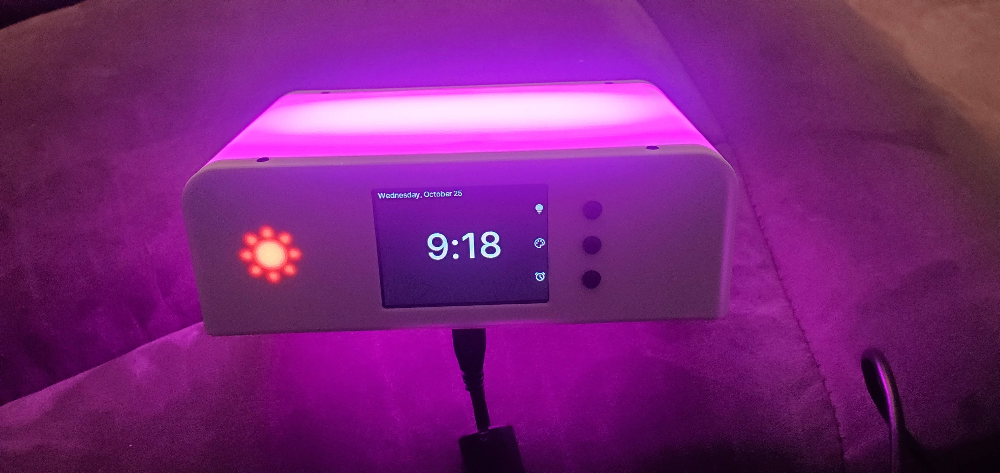

# Emily.Clock

This is a fun little nightlight clock project I created for my daughter.

[Watch it in action](media/20231024_232243~3.mp4)

## Project Overview

### Features

- Nightlight with 7 color options (red, orange, yellow, green, blue, indigo, violet) and 5 brightness levels
- Sun and moon indicator LEDs that switch based on configured bedtime and wake time
- Retrieves current time from WiFi connection
- Dual WiFi mode: connects as a client or hosts its own access point for initial setup
- Web UI for wireless client configuration
- REST API for device info, network status, and configuration management

### Structure

One of the goals of the application was to design it in such a way that someone else, with different hardware, would be able to quickly and easily reuse the majority of my code.

**Emily.Clock**

- Implements main application logic with the goal of being disconnected from the underlying hardware

**Emily.Clock.App**

- Implements device-specific functionality (GPIO pin configuration, hardware-specific implementations for display, LED chipset, etc.)

**Emily.Clock.UnitTests**

- Unit tests for the core library

### REST API

The device hosts an HTTP server on port 80 with the following endpoints:

| Method | Endpoint | Description |
|--------|----------|-------------|
| GET | `/api/device` | Device info (free memory, serial number, uptime) |
| GET | `/api/device/network` | Network interface info |
| GET | `/api/device/ping` | Health check |
| POST | `/api/device/reboot` | Reboot the device |
| GET | `/api/configuration` | List configuration sections |
| GET | `/api/configuration/{section}` | Get configuration for a section |
| POST | `/api/configuration/{section}` | Save configuration for a section |

Configuration sections: `alarm`, `datetime`, `nightlight`, `wireless-access-point`, `wireless-client`

## Hardware

The 3D models and source code were designed around the following hardware:

- [LILYGO® TTGO T4 V1.3 2.4 inch](https://amzn.to/47eONBK)
- [MAX98357A I2S Audio Amplifier](https://amzn.to/3FKNz5n)
- [DS3231SN Real Time Clock](https://amzn.to/3st1r17)
- [4 Ohm 3 Watt Speaker](https://amzn.to/3siM7UU)

*Some of these links may be affiliate links, so I may earn a small commission when you make a purchase through these links at no additional cost to you.*

The `models` folder contains the Fusion 360 and STEP files for 3D printing the case. Individual STEP files for each component (shell, panels, buttons, light bar, etc.) are in `models/step`.

You can swap out any of the hardware and adjust the Fusion 360 model or design your own case.

## TODO

The more I worked on this the more I wanted to do with it. Currently the following features on the roadmap (in no particular order)

- Alarm functionality (in progress, needs UI)
- Audio provider (I2S completed, consider piezzo buzzer)
- Expand web interface to cover nightlight, alarm, and time settings (wireless client setup is already working)
- Battery-powered RTC for situations where the WiFi is temporarily unavailable

## Background and History

Initially I started the project using [PlatformIO](https://platformio.org/), which is a great toolchain/IDE, but quickly got burnt out with C/C++ so the project stalled. At the time I was aware of the Python solutions available for embedded development but I dislike working in Python even more than C/C++ so...

Luckily [José Simões](https://github.com/josesimoes) joined the [Unexpected Maker](https://unexpectedmaker.com/) Discord and mentioned [.NET nanoFramework](https://www.nanoframework.net/). Being that my day job is a software engineer working on the .NET Core stack it was a no brainer for me to checkout [.NET nanoFramework](https://www.nanoframework.net/).

I've been very impressed with [.NET nanoFramework](https://www.nanoframework.net/) and the surrounding community. I cannot recommend it enough for anyone the enjoys working with C# and wants to accelerate their embedded development.
